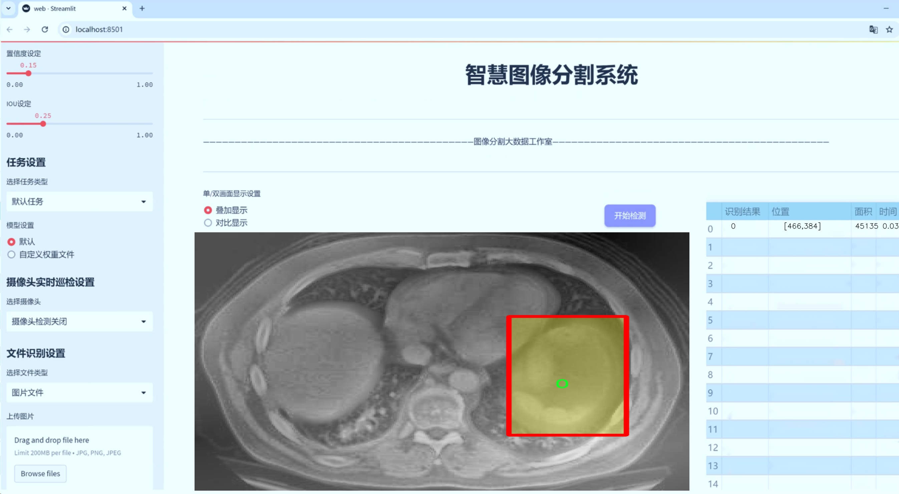
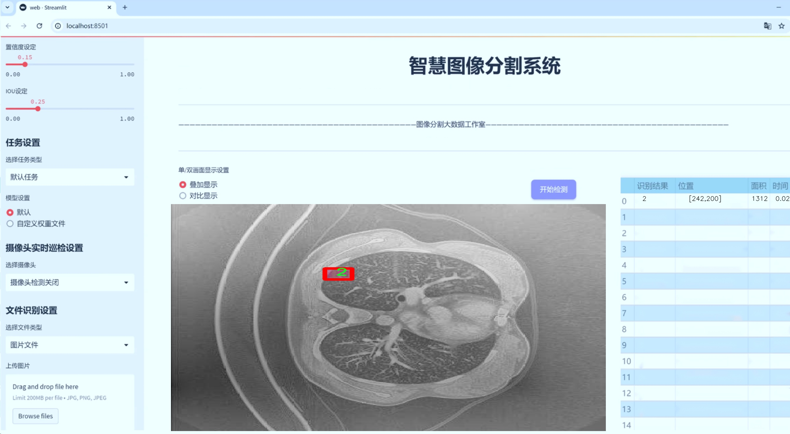
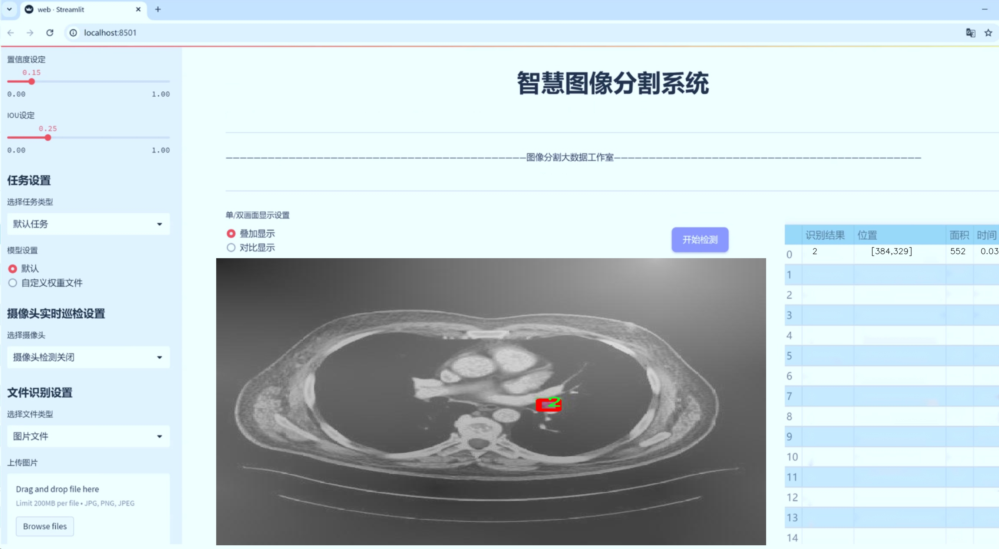
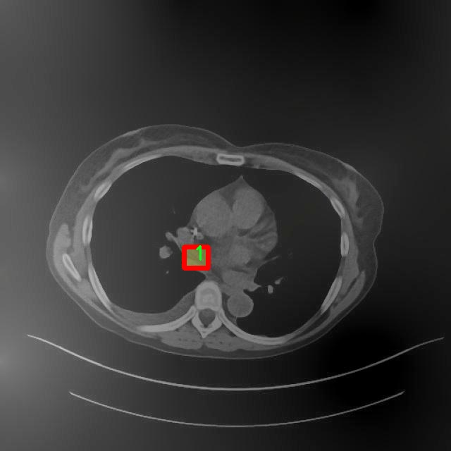
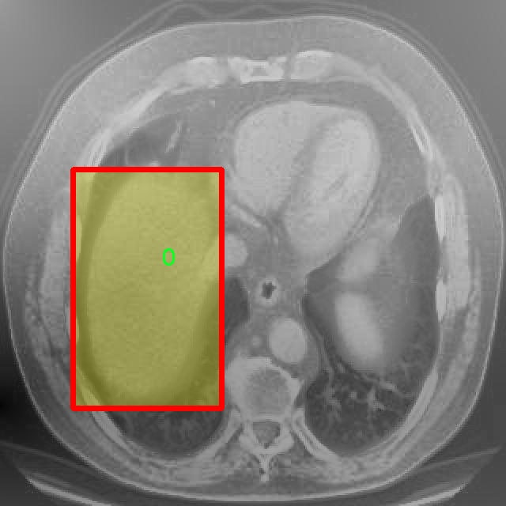
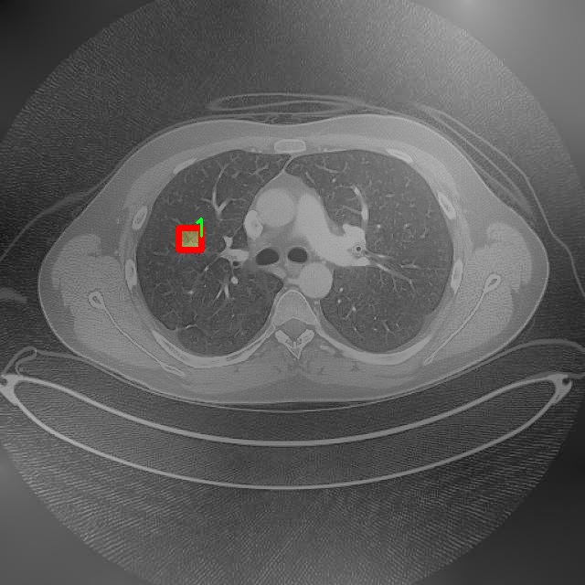
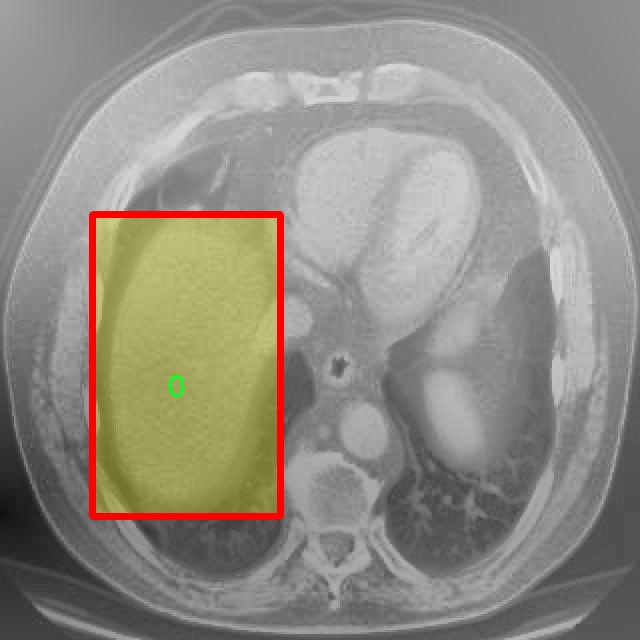
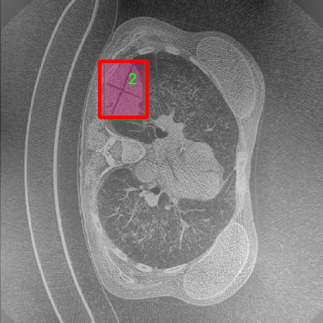

# 胸部CT图像分割系统： yolov8-seg-vanillanet

### 1.研究背景与意义

[参考博客](https://gitee.com/YOLOv8_YOLOv11_Segmentation_Studio/projects)

[博客来源](https://kdocs.cn/l/cszuIiCKVNis)

研究背景与意义

随着医学影像技术的迅速发展，计算机辅助诊断（CAD）系统在临床应用中的重要性日益凸显。胸部CT（计算机断层扫描）作为一种常用的医学影像检查手段，能够提供详细的胸部结构信息，对于早期发现和诊断肺部疾病，如肺癌、肺炎及其他胸部病变，具有重要的临床价值。然而，传统的胸部CT图像分析往往依赖于放射科医生的经验，存在主观性强、效率低下等问题。因此，基于深度学习的图像分割技术逐渐成为研究的热点，尤其是在实例分割领域，其能够有效提高医学影像的分析精度和效率。

YOLO（You Only Look Once）系列模型因其高效的实时检测能力而受到广泛关注。YOLOv8作为该系列的最新版本，具有更强的特征提取能力和更高的检测精度，适用于复杂的医学图像分析任务。通过对YOLOv8模型的改进，可以进一步提升其在胸部CT图像分割中的表现，尤其是在处理多类别病变时的准确性和鲁棒性。本研究旨在基于改进的YOLOv8模型，构建一个高效的胸部CT图像分割系统，以实现对胸部病变的精准定位和分割。

本研究所使用的数据集包含4500幅胸部CT图像，涵盖了三类不同的病变。这一数据集的规模和多样性为模型的训练和验证提供了坚实的基础。通过对不同类别的病变进行实例分割，不仅可以提高模型对各类病变的识别能力，还能为临床医生提供更为直观的辅助信息，帮助其做出更为准确的诊断决策。此外，数据集中不同类别的病变样本数量的均衡性，有助于避免模型在训练过程中出现偏倚，从而提升其在实际应用中的普适性和可靠性。

在医学影像分析领域，准确的图像分割不仅有助于病变的定量分析，还能够为后续的治疗方案制定提供重要依据。通过实现对胸部CT图像的高效分割，研究将为临床医生提供一种新的辅助工具，提升诊断效率，降低误诊率。同时，该系统的成功构建也将为其他类型医学影像的分割研究提供借鉴，推动医学影像分析技术的进一步发展。

综上所述，基于改进YOLOv8的胸部CT图像分割系统的研究具有重要的理论意义和实际应用价值。通过深入探索深度学习在医学影像分割中的应用，不仅能够提升胸部疾病的诊断效率，还将为医学影像分析领域的技术创新提供新的思路和方法。这一研究的成功实施，必将为未来的医学影像处理和智能诊断系统的发展奠定坚实的基础。

### 2.图片演示







注意：本项目提供完整的训练源码数据集和训练教程,由于此博客编辑较早,暂不提供权重文件（best.pt）,需要按照6.训练教程进行训练后实现上图效果。

### 3.视频演示

[3.1 视频演示](https://www.bilibili.com/video/BV14JB1Y3EuJ/)

### 4.数据集信息

##### 4.1 数据集类别数＆类别名

nc: 3
names: ['0', '1', '2']


##### 4.2 数据集信息简介

数据集信息展示

在本研究中，我们使用了名为“chest ct”的数据集，以训练和改进YOLOv8-seg模型，旨在实现胸部CT图像的高效分割。该数据集的构建和选择至关重要，因为它直接影响到模型的性能和分割精度。数据集包含了多种胸部CT图像，经过精心标注，确保了数据的质量和可靠性。数据集的类别数量为3，分别标记为‘0’，‘1’和‘2’，这些类别代表了不同的组织或病变特征，具体的类别定义将在后续的模型训练和评估中进一步明确。

在医学影像分析中，CT图像的分割任务具有重要的临床意义。通过精确分割出不同的组织和病变区域，医生能够更好地进行诊断和治疗方案的制定。因此，构建一个高质量的分割模型不仅能够提高分割的准确性，还能在临床实践中提供重要的辅助决策支持。数据集“chest ct”正是为了满足这一需求而设计的，包含了多种典型的胸部病变影像，如肿瘤、结节和其他异常结构，能够为模型的训练提供丰富的样本。

在数据集的构建过程中，所有的CT图像均经过专业放射科医生的标注，确保每个类别的标注准确无误。这种高质量的标注不仅提高了数据集的可信度，也为后续的模型训练提供了坚实的基础。数据集中的每一幅图像都经过了严格的筛选，确保其在临床上具有代表性和实用性。通过对不同类别的样本进行均衡分配，我们能够有效地避免模型在训练过程中出现偏倚现象，从而提升模型的泛化能力。

此外，为了增强模型的鲁棒性和适应性，我们在数据集的使用过程中还采用了数据增强技术。这些技术包括旋转、平移、缩放、翻转等操作，旨在增加训练样本的多样性，提升模型对不同影像特征的识别能力。通过这些方法，我们期望能够使YOLOv8-seg模型在面对真实世界中的复杂影像时，依然能够保持良好的分割性能。

在模型训练完成后，我们将对其进行严格的评估，以验证其在胸部CT图像分割任务中的有效性。评估指标将包括分割精度、召回率和F1-score等，通过这些指标，我们能够全面了解模型的表现，并与现有的分割方法进行对比分析。最终，我们希望通过本研究能够为胸部CT图像的自动分割提供一种新的解决方案，推动医学影像分析领域的发展。

综上所述，数据集“chest ct”在本研究中发挥了不可或缺的作用，其丰富的样本和高质量的标注为YOLOv8-seg模型的训练提供了坚实的基础。通过对该数据集的深入分析和利用，我们期待能够在胸部CT图像分割领域取得显著的进展，为临床诊断和治疗提供更为有效的技术支持。











### 5.项目依赖环境部署教程（零基础手把手教学）

[5.1 环境部署教程链接（零基础手把手教学）](https://www.bilibili.com/video/BV1jG4Ve4E9t/?vd_source=bc9aec86d164b67a7004b996143742dc)


[5.2 安装Python虚拟环境创建和依赖库安装视频教程链接（零基础手把手教学）](https://www.bilibili.com/video/BV1nA4VeYEze/?vd_source=bc9aec86d164b67a7004b996143742dc)

### 6.手把手YOLOV8-seg训练视频教程（零基础手把手教学）

[6.1 手把手YOLOV8-seg训练视频教程（零基础小白有手就能学会）](https://www.bilibili.com/video/BV1cA4VeYETe/?vd_source=bc9aec86d164b67a7004b996143742dc)


按照上面的训练视频教程链接加载项目提供的数据集，运行train.py即可开始训练



     Epoch   gpu_mem       box       obj       cls    labels  img_size
     1/200     0G   0.01576   0.01955  0.007536        22      1280: 100%|██████████| 849/849 [14:42<00:00,  1.04s/it]
               Class     Images     Labels          P          R     mAP@.5 mAP@.5:.95: 100%|██████████| 213/213 [01:14<00:00,  2.87it/s]
                 all       3395      17314      0.994      0.957      0.0957      0.0843

     Epoch   gpu_mem       box       obj       cls    labels  img_size
     2/200     0G   0.01578   0.01923  0.007006        22      1280: 100%|██████████| 849/849 [14:44<00:00,  1.04s/it]
               Class     Images     Labels          P          R     mAP@.5 mAP@.5:.95: 100%|██████████| 213/213 [01:12<00:00,  2.95it/s]
                 all       3395      17314      0.996      0.956      0.0957      0.0845

     Epoch   gpu_mem       box       obj       cls    labels  img_size
     3/200     0G   0.01561    0.0191  0.006895        27      1280: 100%|██████████| 849/849 [10:56<00:00,  1.29it/s]
               Class     Images     Labels          P          R     mAP@.5 mAP@.5:.95: 100%|███████   | 187/213 [00:52<00:00,  4.04it/s]
                 all       3395      17314      0.996      0.957      0.0957      0.0845


### 7.50+种全套YOLOV8-seg创新点加载调参实验视频教程（一键加载写好的改进模型的配置文件）

[7.1 50+种全套YOLOV8-seg创新点加载调参实验视频教程（一键加载写好的改进模型的配置文件）](https://www.bilibili.com/video/BV1Hw4VePEXv/?vd_source=bc9aec86d164b67a7004b996143742dc)

### YOLOV8-seg算法简介

原始YOLOv8-seg算法原理

YOLOv8-seg算法是YOLO系列中的最新版本，代表了目标检测和分割技术的前沿进展。作为一种一阶段目标检测算法，YOLOv8-seg不仅继承了YOLO系列的高效性和准确性，还在此基础上进行了深度优化，特别是在目标分割方面的应用，使其在处理复杂场景时表现出色。该算法的核心理念是将目标检测和实例分割任务结合起来，通过一个统一的网络架构实现高效的实时处理。

YOLOv8-seg的网络结构由三个主要部分组成：主干网络（Backbone）、特征增强网络（Neck）和检测头（Head）。在主干网络中，YOLOv8-seg采用了CSP（Cross Stage Partial）结构，这种结构通过分离特征图的处理过程，减少了计算量并提高了特征提取的效率。主干网络的设计旨在提取图像中的深层特征，确保在不同层次上都能捕捉到丰富的信息，从而为后续的目标检测和分割提供坚实的基础。

特征增强网络是YOLOv8-seg的另一重要组成部分，它采用了PAN-FPN（Path Aggregation Network - Feature Pyramid Network）的思想。这种结构通过多尺度特征融合，将来自主干网络不同阶段的特征图进行有效结合，使得模型能够更好地处理不同尺度和形状的目标。特征增强网络不仅提高了目标检测的性能，还增强了模型在复杂场景下的鲁棒性，使得YOLOv8-seg能够在多种应用场景中表现出色。

在检测头部分，YOLOv8-seg引入了解耦头的设计，将目标分类和定位任务分开处理。这种解耦的方式使得每个任务能够更加专注于自身的目标，从而有效地减少了在复杂场景下出现的定位不准和分类错误的问题。通过这种设计，YOLOv8-seg能够在目标检测和实例分割任务中实现更高的精度，特别是在需要精细分割的应用场景中，表现尤为突出。

YOLOv8-seg的一个显著特点是其采用了Anchor-free的目标检测方法。这种方法不再依赖于预定义的锚点框，而是通过回归的方式直接预测目标的位置和大小。这一创新极大地简化了模型的设计和训练过程，同时也提高了检测的灵活性和准确性。传统的目标检测方法往往需要针对不同的目标尺度和形状进行复杂的锚点框设计，而YOLOv8-seg通过直接预测目标的边界框，能够更快速地聚焦于目标位置的邻近点，从而使得预测框更接近于实际的目标边界。

在算法的训练过程中，YOLOv8-seg采用了新的Pytorch训练和部署框架，使得自定义模型的训练变得更加方便。通过引入多尺度训练和测试策略，YOLOv8-seg能够在不同的输入尺寸下进行有效的训练，从而提高模型的泛化能力。此外，YOLOv8-seg还支持各种数据增强技术，以进一步提升模型的鲁棒性和准确性。

YOLOv8-seg的设计不仅关注模型的性能提升，还考虑到实际应用中的计算效率。与之前的YOLO版本相比，YOLOv8-seg在训练时间和检测精度上都得到了显著提升，同时模型的权重文件也进行了轻量化处理，使其能够在各种嵌入式设备上高效运行。这一特性使得YOLOv8-seg在实时检测需求日益增长的背景下，成为了一个理想的选择。

在实际应用中，YOLOv8-seg展现出了广泛的适用性。无论是在智能监控、自动驾驶，还是在医疗影像分析和人脸识别等领域，YOLOv8-seg都能够提供高效、准确的目标检测和分割解决方案。其强大的性能和灵活的架构，使得YOLOv8-seg不仅能够满足当前的技术需求，还为未来的研究和应用提供了广阔的空间。

综上所述，YOLOv8-seg算法在目标检测和实例分割领域的创新性设计，充分体现了YOLO系列算法的不断进化。通过结合先进的网络结构、解耦的任务处理方式以及Anchor-free的检测策略，YOLOv8-seg不仅提升了目标检测的精度和速度，还为复杂场景下的目标分割提供了强有力的支持。这一算法的推出，标志着目标检测技术向更高层次的迈进，为相关领域的研究和应用开辟了新的可能性。


### 9.系统功能展示（检测对象为举例，实际内容以本项目数据集为准）

图9.1.系统支持检测结果表格显示

  图9.2.系统支持置信度和IOU阈值手动调节

  图9.3.系统支持自定义加载权重文件best.pt(需要你通过步骤5中训练获得)

  图9.4.系统支持摄像头实时识别

  图9.5.系统支持图片识别

  图9.6.系统支持视频识别

  图9.7.系统支持识别结果文件自动保存

  图9.8.系统支持Excel导出检测结果数据


### 10.50+种全套YOLOV8-seg创新点原理讲解（非科班也可以轻松写刊发刊，V11版本正在科研待更新）

#### 10.1 由于篇幅限制，每个创新点的具体原理讲解就不一一展开，具体见下列网址中的创新点对应子项目的技术原理博客网址【Blog】：


[10.1 50+种全套YOLOV8-seg创新点原理讲解链接](https://gitee.com/qunmasj/good)

#### 10.2 部分改进模块原理讲解(完整的改进原理见上图和技术博客链接)【如果此小节的图加载失败可以通过CSDN或者Github搜索该博客的标题访问原始博客，原始博客图片显示正常】
### YOLOv8简介
目前YOLO系列的SOTA模型是ultralytics公司于2023年发布的YOLOv8.按照模型宽度和深度不同分为YOLOv8n、YOLOv8s、YOLOv8m、YOLOv81、YOLOv8x五个版本。本文改进的是 YOLOv8n模型。
YOLOv8的 Backbone采用CSPDarknet结构，它是 Darknet 的一种改进，引入CSP改善网络结构。CSPDarknet把特征图分为两部分，一部分进行卷积操作，另一部分进行跳跃连接，在保持网络深度的同时减少参数量和计算量，提高网络效率。Neck 部分采用特征金字塔PANet[17]，通过自顶向下路径结合和自底向上特征传播进行多尺度融合。损失函数采用了CIloU[18]。YOLOv8的网络结构如图所示。


### ParC融合位置感知循环卷积简介
ParC：Position aware circular convolution


#### Position aware circular convolution
针对于全局信息的提取作者提出了Position aware circular convolution（也称作Global Circular Convolution）。图中左右实际是对于该操作水平竖直两方向的对称，理解时只看左边即可。对于维度为C*H*W的输入，作者先将维度为C*B*1的Position Embedding通过双线性插值函数F调整到适合input的维度C*H*1（以适应不同特征大小输入），并且将PE水平复制扩展到C*H*W维度与输入特征相加。这里作者将PE直接设置成为了可学习的参数。

接下来参考该博客将加入PE的特征图竖直方向堆叠，并且同样以插值的方式得到了适应输入维度的C*H*1大小的卷积核，进行卷积操作。对于这一步卷积，作者将之称为循环卷积，并给出了一个卷积示意图。


但个人感觉实际上这个示意图只是为了说明为什么叫循环卷积，对于具体的计算细节还是根据公式理解更好。


进一步，作者给出了这一步的伪代码来便于读者对这一卷积的理解：y=F.conv2D（torch.cat（xp，xp，dim=2），kV），实际上就是将xp堆叠之后使用了一个“条形（或柱形）”卷积核进行简单的卷积操作。（但这样会导致多一次重复卷积，因此在堆叠示意图中只取了前2*H-1行）

可以看到在示意图中特征维度变化如下：C*(2H-1)*W ---C*H*1--->C*H*W，作者特意带上了通道数，并且并没有出现通道数的改变，那么这里所进行的卷积应该是depth wise卷积，通过对文章后续以及论文源码的阅读可以得知这一步进行的就是DW卷积。（we introduce group convolution and point wise convolution into these modules, which decreases number of parameters without hurting performance.）


由groups = channel可知使用的是DW卷积
通过上面就完成了一次竖直方向的全局信息交流，同样只要在水平方向进行同样的操作即可做到水平方向的全局信息交流。

#### ParC block

通过ParC成功解决了全局信息提取的问题，接下来就是针对2）3）两点进行改进。首先是Meta-Former模块，Meta-Former由Token Mixer和Channel Mixer构成，ParC首先满足了Token Mixer的全局信息提取的要求，并且相较于Attention在计算成本上更低。


这里①中的PWC即point wise conv，进一步验证了我们前面对于深度可分离卷积的想法，而GCC-H/V即是前面所说的ParC-H/V。

①构建了Meta-Former中的Token mixer模块，那么最后剩下的问题就是3），替换掉Attention模块之后模型不再data driven。为了解决这一点作者给出了一个channel wise attention，先将特征图（x,C*H*W）进行global average（a,C*1*1）并输入一个MLP生成一个channel wise的权重（w,C*1*1），再将权重与特征图在通道方向相乘得到输出（output = wx,C*H*W）。

#### ParC net
对于ParC net 的搭建，作者直接基于MobileViT，采用了分叉结构（c）完成了网络的搭建。


具体而言作者保留了MobileViT中浅层具有局部感受野的MobileNetV2结构，而将网络深层的ViT block替换成了ParC block，使网络变成了一个pure ConvNet。


### 11.项目核心源码讲解（再也不用担心看不懂代码逻辑）

#### 11.1 ultralytics\models\rtdetr\__init__.py

下面是对给定代码的核心部分进行分析和详细注释的结果：

```python
# Ultralytics YOLO 🚀, AGPL-3.0 license

# 从当前包中导入 RTDETR 模型、RTDETR 预测器和 RTDETR 验证器
from .model import RTDETR  # 导入 RTDETR 模型类
from .predict import RTDETRPredictor  # 导入 RTDETR 预测器类
from .val import RTDETRValidator  # 导入 RTDETR 验证器类

# 定义该模块的公共接口，指定可以被外部访问的类
__all__ = 'RTDETRPredictor', 'RTDETRValidator', 'RTDETR'
```

### 代码分析：
1. **导入模块**：
   - `from .model import RTDETR`：从当前包的 `model` 模块中导入 `RTDETR` 类，这个类通常是用于定义模型的结构和参数。
   - `from .predict import RTDETRPredictor`：从当前包的 `predict` 模块中导入 `RTDETRPredictor` 类，这个类负责使用模型进行预测。
   - `from .val import RTDETRValidator`：从当前包的 `val` 模块中导入 `RTDETRValidator` 类，这个类用于验证模型的性能。

2. **公共接口**：
   - `__all__` 是一个特殊的变量，用于定义当使用 `from module import *` 时，哪些名称是可以被导入的。在这里，`RTDETRPredictor`、`RTDETRValidator` 和 `RTDETR` 被列为公共接口，意味着它们是该模块的主要功能部分，用户可以直接使用这些类。

### 总结：
这段代码主要是为了组织和管理 RTDETR 模型相关的功能模块，提供了模型的定义、预测和验证的接口，便于用户使用和扩展。

这个文件是一个Python模块的初始化文件，位于Ultralytics YOLO项目的RTDETR子模块中。它的主要作用是导入该模块中定义的类和功能，并定义了模块的公共接口。

首先，文件开头的注释部分表明该项目使用的是AGPL-3.0许可证，并且是Ultralytics YOLO的一部分。这为用户提供了有关使用该代码的法律信息。

接下来，文件通过相对导入的方式引入了三个重要的组件：`RTDETR`、`RTDETRPredictor`和`RTDETRValidator`。这些组件分别来自于同一模块中的不同文件。`RTDETR`通常是一个模型类，负责定义和实现RTDETR模型的结构和功能；`RTDETRPredictor`则是一个预测器类，可能用于执行模型的推理操作；而`RTDETRValidator`则可能用于验证模型的性能，比如在验证集上评估模型的准确性。

最后，`__all__`变量定义了该模块的公共接口，这意味着当使用`from module import *`语句时，只会导入这些指定的类。这是一种封装机制，帮助用户了解该模块中可以直接使用的内容，同时也避免了不必要的名称冲突。

总的来说，这个初始化文件的作用是将RTDETR模块的核心功能集中起来，方便用户导入和使用。

#### 11.2 ultralytics\models\yolo\detect\predict.py

以下是经过简化和注释的核心代码部分：

```python
# 导入必要的模块
from ultralytics.engine.predictor import BasePredictor
from ultralytics.engine.results import Results
from ultralytics.utils import ops

class DetectionPredictor(BasePredictor):
    """
    DetectionPredictor类，继承自BasePredictor类，用于基于检测模型进行预测。
    """

    def postprocess(self, preds, img, orig_imgs):
        """
        对预测结果进行后处理，并返回Results对象的列表。

        参数:
        preds: 模型的预测结果
        img: 输入图像
        orig_imgs: 原始图像列表

        返回:
        results: 包含后处理结果的Results对象列表
        """
        # 应用非极大值抑制（NMS）来过滤预测框
        preds = ops.non_max_suppression(preds,
                                        self.args.conf,  # 置信度阈值
                                        self.args.iou,   # IOU阈值
                                        agnostic=self.args.agnostic_nms,  # 是否使用类别无关的NMS
                                        max_det=self.args.max_det,  # 最大检测框数量
                                        classes=self.args.classes)  # 需要检测的类别

        # 如果输入的原始图像不是列表，则将其转换为numpy数组
        if not isinstance(orig_imgs, list):
            orig_imgs = ops.convert_torch2numpy_batch(orig_imgs)

        results = []  # 初始化结果列表
        for i, pred in enumerate(preds):  # 遍历每个预测结果
            orig_img = orig_imgs[i]  # 获取对应的原始图像
            # 将预测框的坐标缩放到原始图像的尺寸
            pred[:, :4] = ops.scale_boxes(img.shape[2:], pred[:, :4], orig_img.shape)
            img_path = self.batch[0][i]  # 获取图像路径
            # 创建Results对象并添加到结果列表
            results.append(Results(orig_img, path=img_path, names=self.model.names, boxes=pred))
        
        return results  # 返回包含所有结果的列表
```

### 代码说明：
1. **导入模块**：导入必要的类和函数以支持预测和结果处理。
2. **DetectionPredictor类**：该类用于处理基于YOLO模型的目标检测预测。
3. **postprocess方法**：这是一个关键方法，用于对模型的预测结果进行后处理，包括：
   - 应用非极大值抑制（NMS）来去除冗余的预测框。
   - 将输入的原始图像转换为numpy数组（如果不是列表）。
   - 遍历每个预测结果，缩放预测框的坐标，并创建结果对象，最后返回所有结果的列表。

这个程序文件是Ultralytics YOLO模型中的一个预测模块，主要用于基于检测模型进行预测。文件中定义了一个名为`DetectionPredictor`的类，该类继承自`BasePredictor`，用于处理图像检测任务。

在类的文档字符串中，提供了一个简单的使用示例，展示了如何从模型文件加载YOLO模型并使用`DetectionPredictor`进行预测。示例中，首先导入了必要的模块，然后定义了一个包含模型路径和数据源的参数字典，接着创建了`DetectionPredictor`的实例，并调用`predict_cli`方法进行预测。

类中定义了一个名为`postprocess`的方法，该方法负责对模型的预测结果进行后处理。具体来说，首先使用非极大值抑制（Non-Maximum Suppression, NMS）来过滤掉重叠的检测框，以提高检测的准确性。这个过程使用了`ops.non_max_suppression`函数，并根据传入的参数（如置信度阈值、IOU阈值等）进行配置。

接下来，方法检查输入的原始图像是否为列表形式。如果不是，则将其转换为NumPy数组，以便后续处理。然后，方法会遍历每个预测结果，调整检测框的坐标，使其与原始图像的尺寸相匹配。最后，将处理后的结果封装为`Results`对象，并返回一个包含所有结果的列表。

总的来说，这个文件的核心功能是通过YOLO模型进行目标检测，并对检测结果进行后处理，以便更好地展示和使用这些结果。

#### 11.3 ultralytics\engine\validator.py

以下是代码中最核心的部分，并附上详细的中文注释：

```python
class BaseValidator:
    """
    BaseValidator 类是用于创建验证器的基类。

    属性:
        args (SimpleNamespace): 验证器的配置。
        dataloader (DataLoader): 用于验证的数据加载器。
        model (nn.Module): 要验证的模型。
        device (torch.device): 用于验证的设备。
        speed (dict): 包含预处理、推理、损失和后处理的处理时间。
        save_dir (Path): 保存结果的目录。
    """

    def __init__(self, dataloader=None, save_dir=None, args=None):
        """
        初始化 BaseValidator 实例。

        参数:
            dataloader (torch.utils.data.DataLoader): 用于验证的数据加载器。
            save_dir (Path, optional): 保存结果的目录。
            args (SimpleNamespace): 验证器的配置。
        """
        self.args = get_cfg(overrides=args)  # 获取配置
        self.dataloader = dataloader  # 设置数据加载器
        self.model = None  # 初始化模型
        self.device = None  # 初始化设备
        self.save_dir = save_dir or get_save_dir(self.args)  # 设置保存目录
        self.speed = {'preprocess': 0.0, 'inference': 0.0, 'loss': 0.0, 'postprocess': 0.0}  # 初始化速度字典

    @smart_inference_mode()
    def __call__(self, trainer=None, model=None):
        """支持验证预训练模型或正在训练的模型。"""
        self.training = trainer is not None  # 判断是否在训练模式
        if self.training:
            self.device = trainer.device  # 获取设备
            model = trainer.model  # 获取模型
            model.eval()  # 设置模型为评估模式
        else:
            model = AutoBackend(model or self.args.model, device=select_device(self.args.device))  # 自动选择后端
            self.device = model.device  # 更新设备

        self.dataloader = self.dataloader or self.get_dataloader(self.args.data, self.args.batch)  # 获取数据加载器
        model.eval()  # 设置模型为评估模式

        for batch_i, batch in enumerate(self.dataloader):  # 遍历数据加载器
            # 预处理
            batch = self.preprocess(batch)

            # 推理
            preds = model(batch['img'])  # 进行推理

            # 更新指标
            self.update_metrics(preds, batch)

        stats = self.get_stats()  # 获取统计信息
        self.print_results()  # 打印结果
        return stats  # 返回统计信息

    def preprocess(self, batch):
        """预处理输入批次。"""
        return batch  # 返回处理后的批次

    def update_metrics(self, preds, batch):
        """根据预测和批次更新指标。"""
        pass  # 具体实现留空

    def get_stats(self):
        """返回模型性能的统计信息。"""
        return {}  # 返回空字典，具体实现留空

    def print_results(self):
        """打印模型预测的结果。"""
        pass  # 具体实现留空
```

### 代码核心部分说明：
1. **BaseValidator 类**：这是一个用于模型验证的基类，包含了验证所需的基本属性和方法。
2. **初始化方法 `__init__`**：在初始化时，获取配置、设置数据加载器、模型和设备等基本信息。
3. **调用方法 `__call__`**：支持验证预训练模型或正在训练的模型，处理推理和统计信息的更新。
4. **预处理方法 `preprocess`**：用于对输入批次进行预处理。
5. **更新指标方法 `update_metrics`**：用于更新模型的性能指标。
6. **获取统计信息方法 `get_stats`**：返回模型的性能统计信息。
7. **打印结果方法 `print_results`**：用于打印模型的预测结果。

这些核心部分构成了模型验证的基础框架，其他方法和功能可以在此基础上进行扩展和实现。

这个程序文件是Ultralytics YOLO框架中的一个验证器（validator），用于检查模型在数据集的测试或验证集上的准确性。它的主要功能是对给定的模型进行验证，并计算其在特定数据集上的性能指标。

首先，文件中定义了一个名为`BaseValidator`的类，这是一个基类，用于创建不同类型的验证器。该类包含多个属性，例如`args`（用于存储验证器的配置）、`dataloader`（用于加载数据的对象）、`model`（待验证的模型）、`device`（验证时使用的设备）等。这些属性为后续的验证过程提供了必要的信息和状态。

在初始化方法`__init__`中，验证器会根据传入的参数设置配置，并创建保存结果的目录。它还会检查图像大小，并为后续的验证过程准备好各种必要的设置。

`__call__`方法是验证器的核心，它支持对预训练模型或正在训练的模型进行验证。根据传入的参数，验证器会选择相应的模型，并设置设备、数据集等信息。接着，它会初始化一些性能指标，并开始验证过程。在验证过程中，程序会循环遍历数据集中的每个批次，进行预处理、推理、后处理，并更新指标。

在验证过程中，程序还会记录每个批次的处理时间，并在验证结束后输出结果。如果设置了保存结果的选项，程序会将预测结果保存为JSON格式。

此外，`BaseValidator`类还定义了一些辅助方法，例如`match_predictions`用于根据IoU（Intersection over Union）值匹配预测和真实标签，`add_callback`和`run_callbacks`用于处理回调函数，`get_dataloader`和`build_dataset`用于获取数据加载器和构建数据集等。

总体来说，这个文件实现了YOLO模型验证的基本框架，提供了灵活的接口和方法，以便于用户根据需要扩展和定制验证过程。

#### 11.4 ultralytics\nn\extra_modules\ops_dcnv3\setup.py

以下是经过简化和注释的核心代码部分：

```python
# 导入必要的库
import os
import glob
import torch
from torch.utils.cpp_extension import CUDA_HOME, CppExtension, CUDAExtension
from setuptools import find_packages, setup

# 定义依赖包
requirements = ["torch", "torchvision"]

def get_extensions():
    # 获取当前文件的目录
    this_dir = os.path.dirname(os.path.abspath(__file__))
    # 定义扩展模块的源代码目录
    extensions_dir = os.path.join(this_dir, "src")

    # 查找主文件和CPU/CUDA源文件
    main_file = glob.glob(os.path.join(extensions_dir, "*.cpp"))
    source_cpu = glob.glob(os.path.join(extensions_dir, "cpu", "*.cpp"))
    source_cuda = glob.glob(os.path.join(extensions_dir, "cuda", "*.cu"))

    # 合并源文件
    sources = main_file + source_cpu
    extension = CppExtension  # 默认使用 CppExtension
    extra_compile_args = {"cxx": []}  # 编译参数
    define_macros = []  # 宏定义

    # 检查CUDA是否可用
    if torch.cuda.is_available() and CUDA_HOME is not None:
        extension = CUDAExtension  # 使用 CUDAExtension
        sources += source_cuda  # 添加CUDA源文件
        define_macros += [("WITH_CUDA", None)]  # 定义宏
        extra_compile_args["nvcc"] = []  # CUDA编译参数
    else:
        raise NotImplementedError('Cuda is not available')  # 如果CUDA不可用，抛出异常

    # 生成完整的源文件路径
    sources = [os.path.join(extensions_dir, s) for s in sources]
    include_dirs = [extensions_dir]  # 包含目录

    # 创建扩展模块
    ext_modules = [
        extension(
            "DCNv3",  # 模块名称
            sources,  # 源文件
            include_dirs=include_dirs,  # 包含目录
            define_macros=define_macros,  # 宏定义
            extra_compile_args=extra_compile_args,  # 编译参数
        )
    ]
    return ext_modules  # 返回扩展模块列表

# 设置包信息和扩展模块
setup(
    name="DCNv3",  # 包名称
    version="1.1",  # 版本号
    author="InternImage",  # 作者
    url="https://github.com/OpenGVLab/InternImage",  # 项目网址
    description="PyTorch Wrapper for CUDA Functions of DCNv3",  # 描述
    packages=find_packages(exclude=("configs", "tests")),  # 查找包，排除特定目录
    ext_modules=get_extensions(),  # 获取扩展模块
    cmdclass={"build_ext": torch.utils.cpp_extension.BuildExtension},  # 指定构建扩展的命令类
)
```

### 代码注释说明：
1. **导入库**：导入了必要的库，包括操作系统相关的库、PyTorch库和setuptools库。
2. **依赖包**：定义了项目所需的依赖包。
3. **获取扩展函数**：定义了一个函数来查找和设置扩展模块的源文件。
4. **CUDA支持检查**：检查CUDA是否可用，并根据可用性选择合适的扩展类型。
5. **模块设置**：使用`setup`函数定义包的元数据和扩展模块信息。

这个 `setup.py` 文件是用于配置和构建一个名为 `DCNv3` 的 Python 包，主要用于 PyTorch 的扩展，特别是与 CUDA 相关的功能。文件开头包含版权信息和许可证声明，表明该代码是由 OpenGVLab 开发并遵循 MIT 许可证。

首先，文件导入了一些必要的模块，包括 `os` 和 `glob` 用于文件路径操作，`torch` 用于与 PyTorch 相关的功能，以及 `setuptools` 中的 `setup` 和 `find_packages` 用于包的设置和查找。

接下来，定义了一个 `requirements` 列表，列出了该包所依赖的其他 Python 包，包括 `torch` 和 `torchvision`。

函数 `get_extensions()` 用于获取要编译的扩展模块。它首先确定当前文件的目录，并构建源代码文件的路径。通过 `glob` 模块，函数查找指定目录下的 C++ 源文件和 CUDA 源文件。主要的 C++ 文件、CPU 相关的 C++ 文件和 CUDA 相关的文件分别被收集到不同的列表中。

在确定了源文件后，函数检查 CUDA 是否可用。如果可用，则使用 `CUDAExtension` 来处理 CUDA 相关的编译，并将 CUDA 源文件添加到源列表中，同时定义了一个宏 `WITH_CUDA`。如果 CUDA 不可用，则抛出一个 `NotImplementedError` 异常，提示用户 CUDA 不可用。

接下来，函数将所有源文件的路径进行整理，并指定包含目录。然后，创建一个扩展模块的列表，其中包含了模块的名称、源文件、包含目录、宏定义和编译参数。

最后，调用 `setup()` 函数来配置包的元数据，包括包的名称、版本、作者、项目网址、描述信息、需要排除的包（如配置和测试文件夹）以及扩展模块。通过 `cmdclass` 参数，指定了构建扩展的命令类为 `torch.utils.cpp_extension.BuildExtension`，以确保在构建时使用 PyTorch 提供的构建工具。

总的来说，这个 `setup.py` 文件的主要功能是配置和构建一个支持 CUDA 的 PyTorch 扩展模块，提供了必要的文件查找、编译和构建步骤。

#### 11.5 ultralytics\models\sam\amg.py

以下是代码中最核心的部分，并附上详细的中文注释：

```python
import torch
from typing import List

def is_box_near_crop_edge(boxes: torch.Tensor,
                          crop_box: List[int],
                          orig_box: List[int],
                          atol: float = 20.0) -> torch.Tensor:
    """
    判断给定的边界框是否接近裁剪边缘。

    参数：
    boxes: 需要检查的边界框，格式为 (N, 4)，其中 N 是边界框的数量，4 表示 (x1, y1, x2, y2)。
    crop_box: 当前裁剪区域的边界框，格式为 [x0, y0, x1, y1]。
    orig_box: 原始图像的边界框，格式为 [x0, y0, x1, y1]。
    atol: 允许的绝对误差，默认为 20.0。

    返回：
    返回一个布尔张量，指示每个边界框是否接近裁剪边缘。
    """
    # 将裁剪框和原始框转换为张量
    crop_box_torch = torch.as_tensor(crop_box, dtype=torch.float, device=boxes.device)
    orig_box_torch = torch.as_tensor(orig_box, dtype=torch.float, device=boxes.device)
    
    # 将边界框从裁剪区域坐标转换为原始图像坐标
    boxes = uncrop_boxes_xyxy(boxes, crop_box).float()
    
    # 检查边界框是否接近裁剪边缘
    near_crop_edge = torch.isclose(boxes, crop_box_torch[None, :], atol=atol, rtol=0)
    near_image_edge = torch.isclose(boxes, orig_box_torch[None, :], atol=atol, rtol=0)
    
    # 仅保留接近裁剪边缘但不接近原始图像边缘的框
    near_crop_edge = torch.logical_and(near_crop_edge, ~near_image_edge)
    
    # 返回是否有任何边界框接近裁剪边缘
    return torch.any(near_crop_edge, dim=1)


def uncrop_boxes_xyxy(boxes: torch.Tensor, crop_box: List[int]) -> torch.Tensor:
    """
    将裁剪的边界框转换回原始图像坐标。

    参数：
    boxes: 裁剪后的边界框，格式为 (N, 4)。
    crop_box: 当前裁剪区域的边界框，格式为 [x0, y0, x1, y1]。

    返回：
    返回转换后的边界框，格式为 (N, 4)。
    """
    x0, y0, _, _ = crop_box
    # 创建偏移量张量
    offset = torch.tensor([[x0, y0, x0, y0]], device=boxes.device)
    
    # 检查 boxes 是否有通道维度
    if len(boxes.shape) == 3:
        offset = offset.unsqueeze(1)
    
    # 返回加上偏移量后的边界框
    return boxes + offset


def batched_mask_to_box(masks: torch.Tensor) -> torch.Tensor:
    """
    计算给定掩码的边界框，返回格式为 XYXY。

    参数：
    masks: 二进制掩码，格式为 CxHxW，其中 C 是通道数，H 是高度，W 是宽度。

    返回：
    返回边界框，格式为 Cx4。
    """
    # 如果掩码为空，返回 [0, 0, 0, 0]
    if torch.numel(masks) == 0:
        return torch.zeros(*masks.shape[:-2], 4, device=masks.device)

    # 规范化形状为 CxHxW
    shape = masks.shape
    h, w = shape[-2:]
    masks = masks.flatten(0, -3) if len(shape) > 2 else masks.unsqueeze(0)
    
    # 获取上边缘和下边缘
    in_height, _ = torch.max(masks, dim=-1)
    in_height_coords = in_height * torch.arange(h, device=in_height.device)[None, :]
    bottom_edges, _ = torch.max(in_height_coords, dim=-1)
    in_height_coords = in_height_coords + h * (~in_height)
    top_edges, _ = torch.min(in_height_coords, dim=-1)

    # 获取左边缘和右边缘
    in_width, _ = torch.max(masks, dim=-2)
    in_width_coords = in_width * torch.arange(w, device=in_width.device)[None, :]
    right_edges, _ = torch.max(in_width_coords, dim=-1)
    in_width_coords = in_width_coords + w * (~in_width)
    left_edges, _ = torch.min(in_width_coords, dim=-1)

    # 处理空掩码的情况
    empty_filter = (right_edges < left_edges) | (bottom_edges < top_edges)
    out = torch.stack([left_edges, top_edges, right_edges, bottom_edges], dim=-1)
    out = out * (~empty_filter).unsqueeze(-1)

    # 返回到原始形状
    return out.reshape(*shape[:-2], 4) if len(shape) > 2 else out[0]
```

### 代码说明：
1. **is_box_near_crop_edge**：判断边界框是否接近裁剪区域的边缘，返回布尔值。
2. **uncrop_boxes_xyxy**：将裁剪后的边界框转换回原始图像坐标。
3. **batched_mask_to_box**：根据给定的掩码计算边界框，返回边界框的坐标。

这个程序文件 `ultralytics\models\sam\amg.py` 是一个用于处理图像分割和边界框的工具库，主要用于生成和处理图像中的掩膜（masks）和边界框（boxes）。以下是对文件中各个函数的逐一讲解。

首先，`is_box_near_crop_edge` 函数用于判断给定的边界框是否接近裁剪边缘。它接受边界框、裁剪框和原始框作为输入，并通过比较边界框与裁剪框和原始框的距离来返回一个布尔张量，指示哪些边界框接近裁剪边缘。

接下来，`batch_iterator` 函数用于生成数据的批次迭代器。它确保所有输入的长度相同，并根据指定的批次大小将数据分成多个批次进行迭代。

`calculate_stability_score` 函数计算一组掩膜的稳定性得分。该得分是通过对掩膜进行阈值处理后计算的交并比（IoU），用于评估掩膜的质量。

`build_point_grid` 函数生成一个二维网格，网格中的点均匀分布在 [0,1] x [0,1] 的范围内，适用于后续的图像处理。

`build_all_layer_point_grids` 函数为所有裁剪层生成点网格。它根据层数和每层的缩放比例生成不同大小的点网格。

`generate_crop_boxes` 函数生成不同大小的裁剪框。它根据输入图像的尺寸、层数和重叠比例计算出裁剪框的位置和大小。

`uncrop_boxes_xyxy` 和 `uncrop_points` 函数用于将裁剪框和点的坐标转换回原始图像的坐标。它们通过添加裁剪框的偏移量来实现这一点。

`uncrop_masks` 函数则用于将掩膜从裁剪区域扩展到原始图像的大小，通过填充的方式实现。

`remove_small_regions` 函数用于去除掩膜中小的孤立区域或孔洞。它使用 OpenCV 库的连通组件分析来识别和处理这些小区域。

`batched_mask_to_box` 函数计算掩膜周围的边界框，返回的格式为 XYXY。对于空掩膜，它返回 [0, 0, 0, 0]，确保输出的一致性。

整体来看，这个文件提供了一系列函数，帮助处理图像分割任务中的掩膜和边界框，包括生成裁剪框、处理掩膜、计算稳定性得分等功能。这些功能对于实现高效的图像分析和处理非常重要。

### 12.系统整体结构（节选）

### 整体功能和构架概括

Ultralytics 项目是一个用于目标检测和图像分割的深度学习框架，提供了多种模型和工具以支持高效的计算机视觉任务。该项目的架构分为多个模块，每个模块负责特定的功能。

1. **模型定义与初始化**：如 `rtdetr` 模块的 `__init__.py` 文件，负责导入和初始化 RTDETR 模型的核心组件，简化用户的使用流程。
2. **目标检测**：`yolo` 模块中的 `predict.py` 文件实现了 YOLO 模型的预测功能，处理输入图像并返回检测结果。
3. **模型验证**：`engine` 模块的 `validator.py` 文件提供了验证模型性能的工具，计算模型在验证集上的准确性和其他性能指标。
4. **扩展模块构建**：`extra_modules` 中的 `setup.py` 文件用于配置和构建与 CUDA 相关的 PyTorch 扩展，确保高效的计算性能。
5. **图像分割处理**：`sam` 模块的 `amg.py` 文件提供了一系列函数，用于处理图像分割任务中的掩膜和边界框，支持裁剪、去噪和坐标转换等功能。

### 文件功能整理表

| 文件路径                                             | 功能描述                                                                                     |
|----------------------------------------------------|---------------------------------------------------------------------------------------------|
| `ultralytics/models/rtdetr/__init__.py`            | 初始化 RTDETR 模型，导入核心组件，定义模块的公共接口。                                      |
| `ultralytics/models/yolo/detect/predict.py`       | 实现 YOLO 模型的预测功能，处理输入图像并返回检测结果，包含后处理逻辑。                      |
| `ultralytics/engine/validator.py`                  | 提供模型验证工具，计算模型在验证集上的性能指标，如准确性和其他评估指标。                   |
| `ultralytics/nn/extra_modules/ops_dcnv3/setup.py` | 配置和构建与 CUDA 相关的 PyTorch 扩展，确保高效的计算性能，支持深度学习模型的扩展。         |
| `ultralytics/models/sam/amg.py`                    | 提供图像分割任务的工具，处理掩膜和边界框，包括裁剪、去噪、坐标转换等功能。                  |

以上表格总结了每个文件的主要功能，展示了 Ultralytics 项目在目标检测和图像分割领域的整体架构和功能模块。

### 13.图片、视频、摄像头图像分割Demo(去除WebUI)代码

在这个博客小节中，我们将讨论如何在不使用WebUI的情况下，实现图像分割模型的使用。本项目代码已经优化整合，方便用户将分割功能嵌入自己的项目中。
核心功能包括图片、视频、摄像头图像的分割，ROI区域的轮廓提取、类别分类、周长计算、面积计算、圆度计算以及颜色提取等。
这些功能提供了良好的二次开发基础。

### 核心代码解读

以下是主要代码片段，我们会为每一块代码进行详细的批注解释：

```python
import random
import cv2
import numpy as np
from PIL import ImageFont, ImageDraw, Image
from hashlib import md5
from model import Web_Detector
from chinese_name_list import Label_list

# 根据名称生成颜色
def generate_color_based_on_name(name):
    ......

# 计算多边形面积
def calculate_polygon_area(points):
    return cv2.contourArea(points.astype(np.float32))

...
# 绘制中文标签
def draw_with_chinese(image, text, position, font_size=20, color=(255, 0, 0)):
    image_pil = Image.fromarray(cv2.cvtColor(image, cv2.COLOR_BGR2RGB))
    draw = ImageDraw.Draw(image_pil)
    font = ImageFont.truetype("simsun.ttc", font_size, encoding="unic")
    draw.text(position, text, font=font, fill=color)
    return cv2.cvtColor(np.array(image_pil), cv2.COLOR_RGB2BGR)

# 动态调整参数
def adjust_parameter(image_size, base_size=1000):
    max_size = max(image_size)
    return max_size / base_size

# 绘制检测结果
def draw_detections(image, info, alpha=0.2):
    name, bbox, conf, cls_id, mask = info['class_name'], info['bbox'], info['score'], info['class_id'], info['mask']
    adjust_param = adjust_parameter(image.shape[:2])
    spacing = int(20 * adjust_param)

    if mask is None:
        x1, y1, x2, y2 = bbox
        aim_frame_area = (x2 - x1) * (y2 - y1)
        cv2.rectangle(image, (x1, y1), (x2, y2), color=(0, 0, 255), thickness=int(3 * adjust_param))
        image = draw_with_chinese(image, name, (x1, y1 - int(30 * adjust_param)), font_size=int(35 * adjust_param))
        y_offset = int(50 * adjust_param)  # 类别名称上方绘制，其下方留出空间
    else:
        mask_points = np.concatenate(mask)
        aim_frame_area = calculate_polygon_area(mask_points)
        mask_color = generate_color_based_on_name(name)
        try:
            overlay = image.copy()
            cv2.fillPoly(overlay, [mask_points.astype(np.int32)], mask_color)
            image = cv2.addWeighted(overlay, 0.3, image, 0.7, 0)
            cv2.drawContours(image, [mask_points.astype(np.int32)], -1, (0, 0, 255), thickness=int(8 * adjust_param))

            # 计算面积、周长、圆度
            area = cv2.contourArea(mask_points.astype(np.int32))
            perimeter = cv2.arcLength(mask_points.astype(np.int32), True)
            ......

            # 计算色彩
            mask = np.zeros(image.shape[:2], dtype=np.uint8)
            cv2.drawContours(mask, [mask_points.astype(np.int32)], -1, 255, -1)
            color_points = cv2.findNonZero(mask)
            ......

            # 绘制类别名称
            x, y = np.min(mask_points, axis=0).astype(int)
            image = draw_with_chinese(image, name, (x, y - int(30 * adjust_param)), font_size=int(35 * adjust_param))
            y_offset = int(50 * adjust_param)

            # 绘制面积、周长、圆度和色彩值
            metrics = [("Area", area), ("Perimeter", perimeter), ("Circularity", circularity), ("Color", color_str)]
            for idx, (metric_name, metric_value) in enumerate(metrics):
                ......

    return image, aim_frame_area

# 处理每帧图像
def process_frame(model, image):
    pre_img = model.preprocess(image)
    pred = model.predict(pre_img)
    det = pred[0] if det is not None and len(det)
    if det:
        det_info = model.postprocess(pred)
        for info in det_info:
            image, _ = draw_detections(image, info)
    return image

if __name__ == "__main__":
    cls_name = Label_list
    model = Web_Detector()
    model.load_model("./weights/yolov8s-seg.pt")

    # 摄像头实时处理
    cap = cv2.VideoCapture(0)
    while cap.isOpened():
        ret, frame = cap.read()
        if not ret:
            break
        ......

    # 图片处理
    image_path = './icon/OIP.jpg'
    image = cv2.imread(image_path)
    if image is not None:
        processed_image = process_frame(model, image)
        ......

    # 视频处理
    video_path = ''  # 输入视频的路径
    cap = cv2.VideoCapture(video_path)
    while cap.isOpened():
        ret, frame = cap.read()
        ......
```


### 14.完整训练+Web前端界面+50+种创新点源码、数据集获取


# [下载链接：https://mbd.pub/o/bread/Z5ialJdq](https://mbd.pub/o/bread/Z5ialJdq)